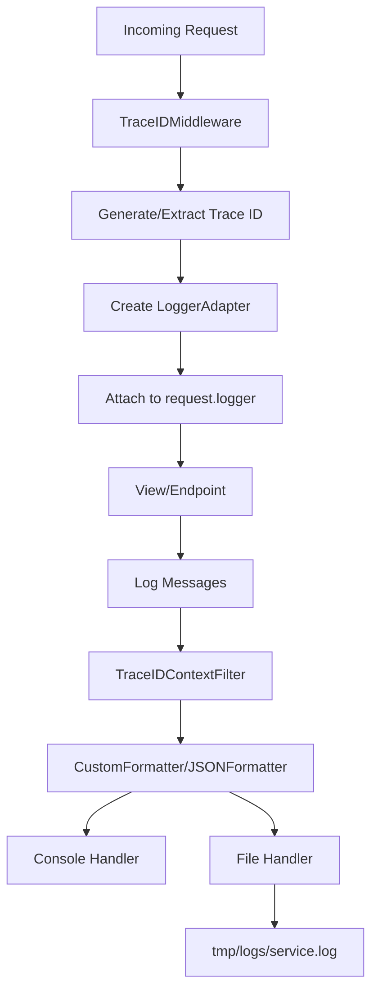

# 🧑‍💻 Developer Guide

This guide provides naming conventions, coding standards, and best practices for contributing to this Django Ninja project.

## Table of Contents

1. [Naming Conventions](#naming-conventions)
2. [Code Style & Standards](#code-style--standards)
3. [Project Structure](#project-structure)
4. [Environment Configuration](#environment-configuration)
5. [Best Practices](#best-practices)
6. [Building APIs](#building-apis-complete-guide)
7. [Logging System](#logging-system)
8. [Testing Naming Conventions](#testing-naming-conventions)
9. [FAQ](#faq)

---

## Naming Conventions

### App Names

**Rule**: Use **plural nouns** with the `_app` suffix in snake_case.

**Pattern**: `{plural_noun}_app`

**Examples**:

- ✅ `animals_app` - manages multiple animals
- ✅ `users_app` - manages multiple users
- ✅ `products_app` - manages multiple products
- ✅ `orders_app` - manages multiple orders
- ❌ `animal_app` - singular (incorrect)
- ❌ `AnimalsApp` - PascalCase (incorrect)
- ❌ `animals-app` - kebab-case (incorrect)

**Rationale**:

- Plural nouns indicate the app manages a collection of entities
- The `_app` suffix clearly distinguishes apps from other modules
- Consistency across the codebase improves readability

**Special Cases**:

- For utility apps: `{function}_app` (e.g., `ping_app`, `auth_app`)
- For feature apps: `{feature}_app` (e.g., `notifications_app`, `payments_app`)

### Model Names

**Rule**: Use **singular nouns** in PascalCase.

**Pattern**: `{SingularNoun}`

**Examples**:

- ✅ `Animal` - represents a single animal
- ✅ `User` - represents a single user
- ✅ `Product` - represents a single product
- ✅ `OrderItem` - compound noun for related entities
- ❌ `Animals` - plural (incorrect)
- ❌ `animal` - lowercase (incorrect)

**Rationale**:

- Django convention: models represent single instances
- PascalCase follows Python class naming conventions (PEP 8)

### Schema Names

**Rule**: Use descriptive names with appropriate suffixes.

**Patterns**:

- Response schemas: `{Model}Schema`
- Create/input schemas: `{Model}CreateSchema` or `{Model}InputSchema`
- Update schemas: `{Model}UpdateSchema`
- Response wrappers: `{Model}ResponseSchema`

**Examples**:

```python
# Good
class AnimalSchema(Schema):          # For responses
    id: int
    name: str

class AnimalCreateSchema(Schema):   # For creation
    name: str

class AnimalUpdateSchema(Schema):   # For updates
    name: Optional[str]

class AnimalResponseSchema(Schema):  # API response wrapper
    data: Optional[AnimalSchema]
    trace_id: uuid.UUID
```

**Rationale**:

- Clear intent: immediately understand the schema's purpose
- Consistent suffixes make code predictable
- Follows Pydantic and API design best practices

### Service Names

**Rule**: Use `{Model}Service` pattern with PascalCase.

**Pattern**: `{Model}Service`

**Examples**:

- ✅ `AnimalService`
- ✅ `UserService`
- ✅ `ProductService`
- ❌ `AnimalServices` - plural (incorrect)
- ❌ `animal_service` - snake_case (incorrect)

**Rationale**:

- Clear separation of concerns (service layer pattern)
- Consistent with class naming conventions
- Easy to locate business logic

### View/Router Names

**Rule**: Use descriptive function names in snake_case for endpoints.

**Patterns**:

- List: `list_{plural_noun}`
- Retrieve: `get_{singular_noun}`
- Create: `create_{singular_noun}`
- Update: `update_{singular_noun}`
- Delete: `delete_{singular_noun}`

**Examples**:

```python
# Good
@router.get("/")
async def list_animals(request):
    """List all animals."""
    pass

@router.get("/{animal_id}/")
async def get_animal(request, animal_id: int):
    """Get a single animal."""
    pass

@router.post("/")
async def create_animal(request, payload: AnimalCreateSchema):
    """Create a new animal."""
    pass
```

**Rationale**:

- Function names follow PEP 8 (snake_case)
- Descriptive names improve code readability
- Consistent CRUD patterns across the codebase

### File Names

**Rule**: Use snake_case for all Python files.

**Standard Files**:

- `models.py` - Database models
- `schemas.py` - Pydantic schemas
- `services.py` - Business logic
- `views.py` - API endpoints
- `admin.py` - Django admin configuration
- `apps.py` - App configuration
- `tests.py` or `test_{feature}.py` - Tests

**Custom Files**:

- `utils.py` - Utility functions
- `constants.py` - Constants and enums
- `exceptions.py` - Custom exceptions
- `decorators.py` - Custom decorators

### Variable Names

**Rule**: Follow PEP 8 naming conventions.

**Patterns**:

- Variables: `snake_case`
- Constants: `UPPER_SNAKE_CASE`
- Private variables: `_leading_underscore`
- Classes: `PascalCase`

**Examples**:

```python
# Good
user_count = 10
MAX_RETRY_ATTEMPTS = 3
_internal_cache = {}

class UserService:
    pass

# Bad
UserCount = 10  # Should be snake_case
maxRetryAttempts = 3  # Should be UPPER_SNAKE_CASE
```

---

## Code Style & Standards

### PEP 8 Compliance

This project follows [PEP 8](https://peps.python.org/pep-0008/) - the official Python style guide.

**Key Points**:

- **Indentation**: 4 spaces (no tabs)
- **Line Length**: Maximum 88 characters (Black formatter default)
- **Imports**:
  - Standard library first
  - Third-party packages second
  - Local imports last
  - Alphabetically sorted within each group

**Example**:

```python
# Standard library
import uuid
from typing import List, Optional

# Third-party
from django.db import models
from ninja import Schema

# Local
from .models import Animal
from .schemas import AnimalCreateSchema
```

### Type Hints

**Rule**: Use type hints for all function signatures and class attributes.

**Examples**:

```python
# Good
async def get_animal(animal_id: int) -> Optional[Animal]:
    return await Animal.objects.filter(id=animal_id).afirst()

def calculate_total(items: List[int]) -> int:
    return sum(items)

# Bad
async def get_animal(animal_id):  # Missing type hints
    return await Animal.objects.filter(id=animal_id).afirst()
```

**Rationale**:

- Improves code readability
- Enables better IDE support
- Catches type errors early with mypy

### Async/Await

**Rule**: Use async/await for all database operations and I/O-bound tasks.

**Examples**:

```python
# Good - Async ORM operations
async def create_animal(name: str) -> Animal:
    return await Animal.objects.acreate(name=name)

async def list_animals() -> List[Animal]:
    return [animal async for animal in Animal.objects.all()]

# Bad - Sync operations (blocking)
def create_animal(name: str) -> Animal:
    return Animal.objects.create(name=name)
```

**Rationale**:

- Non-blocking operations improve performance
- Better scalability for concurrent requests
- Follows Django Ninja async best practices

### Docstrings

**Rule**: Use docstrings for all public functions, classes, and modules.

**Format**: Google-style docstrings

**Examples**:

```python
def create_animal(name: str, species: str, age: int) -> Animal:
    """Create a new animal instance.
    
    Args:
        name: The animal's name
        species: The animal's species
        age: The animal's age in years
        
    Returns:
        The created Animal instance
        
    Raises:
        ValidationError: If the data is invalid
    """
    pass
```

### Error Handling

**Rule**: Use specific exceptions and provide meaningful error messages.

**Examples**:

```python
# Good
try:
    animal = await AnimalService.get_animal(animal_id)
    if not animal:
        return 404, {"error": "Animal not found"}
except ValidationError as e:
    request.logger.error(f"Validation failed: {e}")
    return 400, {"error": str(e)}
except Exception as e:
    request.logger.exception("Unexpected error occurred")
    raise

# Bad
try:
    animal = await AnimalService.get_animal(animal_id)
except:  # Bare except
    pass  # Silent failure
```

---

## Project Structure

### App Organization

```bash
apps/
├── {app_name}/              # App root (plural noun + _app)
│   ├── __init__.py
│   └── v1/                  # Version 1
│       ├── __init__.py
│       ├── admin.py         # Django admin
│       ├── apps.py          # App config
│       ├── models.py        # Database models
│       ├── schemas.py       # Pydantic schemas
│       ├── services.py      # Business logic
│       ├── views.py         # API endpoints
│       └── tests.py         # Tests (optional)
```

### Versioning Strategy

**Rule**: Use versioned directories (v1, v2, etc.) for API evolution.

**Benefits**:

- Backward compatibility
- Gradual migration
- Clear API versioning

**Example**:

```python
# main/urls.py
from apps.animals_app.v1.views import router as animals_v1_router
from apps.animals_app.v2.views import router as animals_v2_router

api.add_router("/v1/animals/", animals_v1_router, tags=["Animals V1"])
api.add_router("/v2/animals/", animals_v2_router, tags=["Animals V2"])
```

---

## Environment Configuration

This project uses environment variables for configuration management. Copy [.env.copy](../.env.copy) to `.env` and configure the variables for your environment.

```bash
cp .env.copy .env
```

### Django Configuration

#### `APP_ENV`

- **Type**: String
- **Default**: `local`
- **Options**: `local`, `dev`, `qa`, `staging`, `prod`
- **Description**: Determines the application environment. Affects logging verbosity, debug mode, and which settings are loaded.
- **Example**: `APP_ENV=local`

#### `DJANGO_SETTINGS_MODULE`

- **Type**: String
- **Default**: `main.settings`
- **Description**: Points to the Django settings module. Should not be changed unless you have a custom settings structure.
- **Example**: `DJANGO_SETTINGS_MODULE=main.settings`

### Database Configuration

#### `DB_ENGINE`

- **Type**: String
- **Default**: `django.db.backends.postgresql`
- **Options**: `django.db.backends.postgresql`, `django.db.backends.mysql`, `django.db.backends.sqlite3`
- **Description**: Django database backend engine.
- **Example**: `DB_ENGINE=django.db.backends.postgresql`

#### `DB_NAME`

- **Type**: String
- **Required**: Yes
- **Description**: Name of the database to connect to.
- **Example**: `DB_NAME=postgres`

#### `DB_USER`

- **Type**: String
- **Required**: Yes
- **Description**: Database user with access to the database.
- **Example**: `DB_USER=postgres`

#### `DB_PASSWORD`

- **Type**: String
- **Required**: Yes
- **Description**: Password for the database user.
- **Example**: `DB_PASSWORD=postgres`
- **Security**: Never commit this value to version control!

#### `DB_HOST`

- **Type**: String
- **Default**: `localhost`
- **Description**: Database server hostname or IP address. Use service name when using Docker Compose.
- **Example**:
  - Local: `DB_HOST=localhost`
  - Docker: `DB_HOST=db` (service name from docker-compose.yml)

#### `DB_PORT`

- **Type**: Integer
- **Default**: `5432` (PostgreSQL)
- **Description**: Port number where the database server is listening.
- **Example**:
  - PostgreSQL: `DB_PORT=5432`
  - MySQL: `DB_PORT=3306`

#### `DB_SCHEMA`

- **Type**: String
- **Default**: `public`
- **Description**: Database schema to use (PostgreSQL specific).
- **Example**: `DB_SCHEMA=public`

### Connection Pooling

#### `DB_CONN_MAX_AGE`

- **Type**: Integer
- **Default**: `10`
- **Description**: Maximum age of database connections in seconds. Set to `0` to disable persistent connections.
- **Example**: `DB_CONN_MAX_AGE=10`
- **Performance**: Higher values reduce connection overhead but consume more database resources.

#### `DB_OPTIONS`

- **Type**: JSON String
- **Default**: `{}`
- **Description**: Additional database connection options as a JSON object.
- **Example**:
  - SSL: `DB_OPTIONS={"sslmode": "require"}`
  - Default: `DB_OPTIONS={}`

### Celery Configuration

Celery is used for asynchronous task processing. All Celery variables are optional.

#### `RUN_CELERY_TOGETHER`

- **Type**: Boolean String
- **Default**: Empty (disabled)
- **Options**: `true`, `false`, or empty
- **Description**: Whether to run Celery workers alongside Django server.
- **Example**:
  - Enable: `RUN_CELERY_TOGETHER=true`
  - Disable: `RUN_CELERY_TOGETHER=false`

#### `CELERY_WORKERS`

- **Type**: Integer
- **Default**: Empty (uses Celery default)
- **Description**: Number of Celery worker processes to spawn.
- **Example**: `CELERY_WORKERS=4`
- **Recommendation**: Set to number of CPU cores for CPU-bound tasks.

#### `CELERY_WORKER_CONCURRENCY`

- **Type**: Integer
- **Default**: Empty (uses Celery default)
- **Description**: Number of concurrent tasks each worker can process.
- **Example**: `CELERY_WORKER_CONCURRENCY=5`
- **Recommendation**: Higher for I/O-bound tasks, lower for CPU-bound tasks.

#### `CELERY_PREFETCH_MULTIPLIER`

- **Type**: Integer
- **Default**: Empty (uses Celery default: 4)
- **Description**: Number of tasks to prefetch per worker process.
- **Example**: `CELERY_PREFETCH_MULTIPLIER=6`
- **Performance**: Lower values (1-2) for long-running tasks, higher for short tasks.

#### `CELERY_POOL`

- **Type**: String
- **Default**: Empty (uses `prefork`)
- **Options**: `prefork`, `gevent`, `eventlet`, `solo`
- **Description**: Execution pool implementation for Celery workers.
- **Example**: `CELERY_POOL=gevent`
- **Use Cases**:
  - `prefork`: CPU-bound tasks (default)
  - `gevent`: I/O-bound tasks (many concurrent connections)
  - `solo`: Single-threaded (debugging)

#### `CELERY_QUEUE_NAME`

- **Type**: String
- **Default**: Empty (uses `celery` default queue)
- **Description**: Name of the Celery task queue.
- **Example**: `CELERY_QUEUE_NAME=django_ninja_queue`

### Uvicorn Configuration

#### `UVICORN_WORKERS`

- **Type**: Integer
- **Default**: Empty (uses 1 worker)
- **Description**: Number of Uvicorn worker processes for the ASGI server.
- **Example**: `UVICORN_WORKERS=4`
- **Recommendation**: Set to `(2 × CPU cores) + 1` for production.
- **Note**: Multiple workers improve concurrency but increase memory usage.

### Supervisor Configuration

#### `USE_SUPERVISOR`

- **Type**: Boolean String
- **Default**: Empty (disabled)
- **Options**: `true`, `false`, or empty
- **Description**: Whether to use Supervisor to manage Django and Celery processes together.
- **Example**:
  - Enable: `USE_SUPERVISOR=true`
  - Disable: `USE_SUPERVISOR=false`
- **Use Case**: Production deployments where you want process monitoring and auto-restart.

### Redis Configuration

Redis is used for caching and as a Celery message broker.

#### `REDIS_USERNAME`

- **Type**: String
- **Default**: `default`
- **Description**: Redis username for authentication (Redis 6.0+).
- **Example**: `REDIS_USERNAME=default`

#### `REDIS_PASSWORD`

- **Type**: String
- **Required**: Yes (if Redis requires authentication)
- **Description**: Password for Redis authentication.
- **Example**: `REDIS_PASSWORD=redis`
- **Security**: Never commit this value to version control!

#### `REDIS_HOST_AND_PORT`

- **Type**: String
- **Format**: `host:port`
- **Default**: `localhost:6379`
- **Description**: Redis server hostname/IP and port.
- **Example**:
  - Local: `REDIS_HOST_AND_PORT=localhost:6379`
  - Docker: `REDIS_HOST_AND_PORT=redis:6379`
  - Remote: `REDIS_HOST_AND_PORT=redis.example.com:6379`

#### `USE_REDIS`

- **Type**: Integer (0 or 1)
- **Default**: `1` (enabled)
- **Options**: `1` (enabled), `0` (disabled)
- **Description**: Enable or disable Redis caching. When disabled, uses in-memory cache.
- **Example**:
  - Enable: `USE_REDIS=1`
  - Disable: `USE_REDIS=0`
- **Use Case**: Disable for local development without Redis, enable for production.

### Environment-Specific Examples

#### Local Development

```bash
APP_ENV=local
DJANGO_SETTINGS_MODULE=main.settings

DB_ENGINE=django.db.backends.postgresql
DB_NAME=myproject_dev
DB_USER=postgres
DB_PASSWORD=postgres
DB_HOST=localhost
DB_PORT=5432
DB_SCHEMA=public

DB_CONN_MAX_AGE=10
DB_OPTIONS={}

# Celery - Optional for local dev
RUN_CELERY_TOGETHER=
CELERY_WORKERS=
CELERY_WORKER_CONCURRENCY=
CELERY_PREFETCH_MULTIPLIER=
CELERY_POOL=
CELERY_QUEUE_NAME=

UVICORN_WORKERS=

USE_SUPERVISOR=

# Redis - Disable if not running Redis locally
REDIS_USERNAME=default
REDIS_PASSWORD=redis
REDIS_HOST_AND_PORT=localhost:6379
USE_REDIS=0  # Use in-memory cache
```

#### Docker Development

```bash
APP_ENV=dev
DJANGO_SETTINGS_MODULE=main.settings

DB_ENGINE=django.db.backends.postgresql
DB_NAME=postgres
DB_USER=postgres
DB_PASSWORD=postgres
DB_HOST=db  # Docker Compose service name
DB_PORT=5432
DB_SCHEMA=public

DB_CONN_MAX_AGE=10
DB_OPTIONS={}

RUN_CELERY_TOGETHER=true
CELERY_WORKERS=2
CELERY_WORKER_CONCURRENCY=4
CELERY_PREFETCH_MULTIPLIER=4
CELERY_POOL=prefork
CELERY_QUEUE_NAME=django_ninja_queue

UVICORN_WORKERS=2

USE_SUPERVISOR=false

REDIS_USERNAME=default
REDIS_PASSWORD=redis
REDIS_HOST_AND_PORT=redis:6379  # Docker Compose service name
USE_REDIS=1
```

#### Production

```bash
APP_ENV=prod
DJANGO_SETTINGS_MODULE=main.settings

DB_ENGINE=django.db.backends.postgresql
DB_NAME=myproject_prod
DB_USER=prod_user
DB_PASSWORD=<strong-password>
DB_HOST=prod-db.example.com
DB_PORT=5432
DB_SCHEMA=public

DB_CONN_MAX_AGE=60
DB_OPTIONS={"sslmode": "require"}

RUN_CELERY_TOGETHER=false
CELERY_WORKERS=8
CELERY_WORKER_CONCURRENCY=10
CELERY_PREFETCH_MULTIPLIER=2
CELERY_POOL=prefork
CELERY_QUEUE_NAME=prod_queue

UVICORN_WORKERS=9  # (2 × 4 cores) + 1

USE_SUPERVISOR=true

REDIS_USERNAME=prod_user
REDIS_PASSWORD=<strong-password>
REDIS_HOST_AND_PORT=redis.example.com:6379
USE_REDIS=1
```

### Best Practices for the Environment Variables

1. **Never Commit `.env`**: Add `.env` to `.gitignore` to prevent committing sensitive data.

2. **Use Strong Passwords**: Generate strong passwords for production databases and Redis.

   ```bash
   # Generate a random password
   openssl rand -base64 32
   ```

3. **Environment-Specific Files**: Consider using `.env.local`, `.env.dev`, `.env.prod` for different environments.

4. **Validate on Startup**: The application validates required environment variables on startup.

5. **Document Custom Variables**: If you add custom environment variables, document them here.

6. **Use Secrets Management**: For production, consider using secrets management tools:
   - AWS Secrets Manager
   - HashiCorp Vault
   - Kubernetes Secrets
   - Azure Key Vault

---

## Best Practices

1. **Follow Naming Conventions**: Use the established patterns for apps, models, schemas, and services
2. **Use Type Hints**: Always annotate function parameters and return types
3. **Async by Default**: Use async/await for all database operations and I/O
4. **Service Layer Pattern**: Keep business logic in services, views should be thin
5. **Proper Error Handling**: Use try-except blocks and log errors appropriately
6. **Request Logging**: Use `request.logger` for automatic trace context
7. **Schema Validation**: Let Pydantic handle all input validation
8. **Docstrings**: Document all public functions and classes

---

## Building APIs: Complete Guide

This section provides a comprehensive, step-by-step guide for building APIs in this Django Ninja project. We'll use the **`animals_app`** as a reference example throughout.

### Overview: The Django Ninja Stack

When building an API endpoint, you'll work with these layers:

```bash
┌─────────────────────────────────────────┐
│  1. Model (models.py)                   │  ← Database schema
├─────────────────────────────────────────┤
│  2. Schema (schemas.py)                 │  ← Request/Response validation
├─────────────────────────────────────────┤
│  3. Service (services.py)               │  ← Business logic
├─────────────────────────────────────────┤
│  4. View (views.py)                     │  ← API endpoints
├─────────────────────────────────────────┤
│  5. Router (urls.py / main/urls.py)     │  ← URL routing
└─────────────────────────────────────────┘
```

### Step 1: Define Your Model

**File**: `apps/{app_name}/v1/models.py`

Models define your database schema using Django ORM.

**Example from animals_app**:

```python
from django.db import models


class Animal(models.Model):
    name = models.CharField(max_length=100)
    species = models.CharField(max_length=50)
    age = models.IntegerField()
    created_at = models.DateTimeField(auto_now_add=True)

    def __str__(self) -> str:
        return self.name
```

**Best Practices**:

- Use descriptive field names
- Add `created_at` and `updated_at` timestamps
- Implement `__str__()` for better admin representation
- Use appropriate field types (`CharField`, `IntegerField`, `ForeignKey`, etc.)
- Add indexes for frequently queried fields

**Common Field Types**:

```python
# Text fields
name = models.CharField(max_length=100)  # Short text
description = models.TextField()  # Long text
email = models.EmailField()  # Email validation

# Numeric fields
age = models.IntegerField()
price = models.DecimalField(max_digits=10, decimal_places=2)
rating = models.FloatField()

# Boolean
is_active = models.BooleanField(default=True)

# Dates
created_at = models.DateTimeField(auto_now_add=True)
updated_at = models.DateTimeField(auto_now=True)
birth_date = models.DateField()

# Relationships
owner = models.ForeignKey(User, on_delete=models.CASCADE)
tags = models.ManyToManyField(Tag)
```

### Step 2: Create Schemas

**File**: `apps/{app_name}/v1/schemas.py`

Schemas define request/response structure and validation using Pydantic.

**Example from animals_app**:

```python
import uuid
from typing import Optional

from ninja import Schema


class AnimalSchema(Schema):
    """Response schema for Animal - includes all fields."""
    id: int
    name: str
    species: str
    age: int


class AnimalCreateSchema(Schema):
    """Input schema for creating/updating Animal - excludes auto-generated fields."""
    name: str
    species: str
    age: int


class AnimalResponseSchema(Schema):
    """Wrapper schema for API responses with metadata."""
    data: Optional[AnimalSchema] = None
    error: Optional[dict] = None
    trace_id: uuid.UUID

    class Config:
        arbitrary_types_allowed = True
```

**Schema Types**:

1. **Response Schema** (`AnimalSchema`): Full object representation
2. **Create Schema** (`AnimalCreateSchema`): Input for POST requests
3. **Update Schema** (`AnimalUpdateSchema`): Input for PUT/PATCH requests
4. **Response Wrapper** (`AnimalResponseSchema`): Standardized API response

**Best Practices**:

- Use descriptive schema names with suffixes (`Schema`, `CreateSchema`, `UpdateSchema`)
- Separate input and output schemas
- Use `Optional` for nullable fields
- Add field validators when needed
- Use `Config` class for Pydantic configuration

**Advanced Validation Example**:

```python
from pydantic import field_validator, Field

class AnimalCreateSchema(Schema):
    name: str = Field(..., min_length=1, max_length=100)
    species: str = Field(..., min_length=1, max_length=50)
    age: int = Field(..., ge=0, le=150)  # Greater than or equal to 0, less than or equal to 150

    @field_validator('name')
    @classmethod
    def name_must_not_be_empty(cls, v: str) -> str:
        if not v.strip():
            raise ValueError('Name cannot be empty or whitespace')
        return v.strip()
```

### Step 3: Implement Service Layer

**File**: `apps/{app_name}/v1/services.py`

Services contain business logic and database operations. Keep views thin!

**Example from animals_app**:

```python
from typing import List, Optional

from .models import Animal
from .schemas import AnimalCreateSchema


class AnimalService:
    @staticmethod
        payload.species
    )
    return {"data": animal}

# Bad - Logic in view
@router.post("/")
async def create_animal(request, payload: AnimalCreateSchema):
    # Business logic mixed with HTTP handling
    animal = await Animal.objects.acreate(
        name=payload.name,
        species=payload.species
    )
    return {"data": animal}
```

### 2. Consistent Response Format

**Rule**: Use standardized response schemas across all endpoints.

```python
# Good - Consistent structure
{
    "data": {...},
    "trace_id": "uuid",
    "error": {}
}

# Use the helper
from common.base_schemas import create_api_response_schema

@router.get("/", response=create_api_response_schema(List[AnimalSchema]))
async def list_animals(request):
    return {
        "data": await AnimalService.list_animals(),
        "trace_id": str(request.trace_id),
        "error": {}
    }
```

### 3. Logging Best Practices

**Rule**: Use the request logger with contextual information.

```python
# Good
@router.post("/")
async def create_animal(request, payload: AnimalCreateSchema):
    request.logger.info(f"Creating animal: {payload.name}")
    
    try:
        animal = await AnimalService.create_animal(...)
        request.logger.info(f"Created animal with ID: {animal.id}")
        return {"data": animal}
    except Exception as e:
        request.logger.exception("Failed to create animal")
        raise
```

### 4. Database Optimization

**Rule**: Use select_related and prefetch_related to avoid N+1 queries.

```python
# Good - Optimized
animals = await Animal.objects.select_related('owner').all()

# Bad - N+1 queries
animals = await Animal.objects.all()
for animal in animals:
    owner = await animal.owner  # Separate query for each animal
```

### 5. Testing

**Rule**: Write tests for all critical functionality.

```python
# tests.py
import pytest
from .services import AnimalService

@pytest.mark.asyncio
async def test_create_animal():
    animal = await AnimalService.create_animal("Simba", "Lion", 5)
    assert animal.name == "Simba"
    assert animal.species == "Lion"
```

---

## Logging System

This project implements a sophisticated logging system with distributed tracing support, structured logging, and context-aware log management. The system automatically tracks requests with trace IDs and provides both human-readable console output and machine-parseable JSON logs.

### Architecture Overview

The logging system consists of three main modules:

1. **[logging.py](../main/settings/logging.py)** - Core logging configuration
2. **[middleware.py](../common/middleware.py)** - Request tracing and logger injection
3. **[logger_helper.py](../common/logger_helper.py)** - Context-aware logger management



### Module 1: Logging Configuration

**File**: [main/settings/logging.py](../main/settings/logging.py)

This module defines the Django logging configuration using the `dictConfig` format.

#### Key Components

**Formatters**:

- `verbose` - Human-readable console output with custom formatting
- `json` - Structured JSON logs for file output and log aggregation

**Handlers**:

- `console` - Outputs to stdout with verbose formatting
- `file` - Writes JSON logs to `tmp/logs/service.log` with daily rotation (keeps 10 days)

**Filters**:

- `trace_id_filter` - Automatically injects trace ID and correlation ID into all log records

**Loggers**:

- `django` - Django framework logs
- `django.request` - HTTP request/response logs
- `django.db.backends` - Database query logs
- `uvicorn.access` - ASGI server access logs
- `uvicorn.error` - ASGI server error logs
- `""` (root) - Catches all other logs

#### Environment-Based Configuration

```python
# Development/Local (APP_ENV not in qa/dev/prod/staging)
- Includes django.server and django.template loggers
- More verbose output for debugging

# Production/Staging/QA/Dev
- Excludes django.server and django.template loggers
- Cleaner logs focused on application behavior
- Ready for Splunk integration (commented out)
```

#### Custom Formatters

**FlexibleJsonFormatter**:

```python
# Adds default values for missing fields
{
    "levelname": "INFO",
    "asctime": "2024-11-24 07:21:14",
    "module": "views",
    "trace_id": "550e8400-e29b-41d4-a716-446655440000",
    "correlation_id": null,
    "process": 12345,
    "thread": 67890,
    "message": "Creating new animal"
}
```

**CustomFormatter**:

```python
# Human-readable format with extra context
INFO 2024-11-24 07:21:14 views 550e8400-e29b-41d4-a716-446655440000 None 12345 67890 Creating new animal | user_id=123 endpoint=/api/v1/animals/
```

### Module 2: Trace ID Middleware

**File**: [common/middleware.py](../common/middleware.py)

The `TraceIDMiddleware` is responsible for request tracing and logger injection.

#### How It Works

1. **Trace ID Generation/Extraction**:
   - Checks for `X-Trace-ID` header in incoming request
   - Generates new UUID if not present
   - Supports `X-Correlation-ID` for distributed tracing

2. **Logger Injection**:
   - Creates a `LoggerAdapter` with trace context
   - Attaches to `request.logger` for easy access
   - Includes request metadata (method, path, user agent, IP)

3. **Request Lifecycle Logging**:
   - Logs request start automatically
   - Logs request completion with status code
   - Logs exceptions with full traceback
   - Cleans up logger context after request

4. **Response Headers**:
   - Adds `X-Trace-ID` to response
   - Adds `X-Correlation-ID` if present

#### TraceIDContextFilter

This filter ensures all log messages include trace context, even if not using `request.logger`:

```python
class TraceIDContextFilter(logging.Filter):
    def filter(self, record):
        # Automatically adds trace_id and correlation_id to all logs
        request_logger = get_request_logger()
        if request_logger:
            record.trace_id = request_logger.trace_id
            record.correlation_id = request_logger.correlation_id
        else:
            record.trace_id = "no-trace-id"
            record.correlation_id = None
        return True
```

### Module 3: Logger Helper

**File**: [common/logger_helper.py](../common/logger_helper.py)

Provides context-aware logger management for both request and background task contexts.

#### LoggerAdapter

Custom adapter that automatically includes trace context in all log messages:

```python
class LoggerAdapter(logging.LoggerAdapter):
    def __init__(self, logger, trace_id, correlation_id=None, **context):
        # Stores trace_id, correlation_id, and custom context
        
    def process(self, msg, kwargs):
        # Automatically adds context to 'extra' field
        
    def update_context(self, **context_updates):
        # Dynamically update logging context
        
    def get_context(self):
        # Retrieve current context
```

#### LoggerHelper (Singleton)

Manages logger adapters using `ContextVar` for async-safe context management:

```python
logger_helper = LoggerHelper()

# Create logger with trace context
logger = logger_helper.create_logger_adapter(
    trace_id="550e8400-e29b-41d4-a716-446655440000",
    correlation_id="abc123",
    logger_name="background_task",
    task_name="data_sync"
)
```

### Usage Patterns

#### 1. Logging in Views (Recommended)

Use `request.logger` - it's automatically configured with trace context:

```python
@router.post("/")
async def create_animal(request, payload: AnimalCreateSchema):
    # Simple logging
    request.logger.info(f"Creating animal: {payload.name}")
    
    try:
        animal = await AnimalService.create_animal(payload.name, payload.species)
        request.logger.info(f"Created animal with ID: {animal.id}")
        return {"data": animal, "trace_id": str(request.trace_id)}
    except ValidationError as e:
        request.logger.error(f"Validation failed: {e}")
        return 400, {"error": str(e)}
    except Exception as e:
        request.logger.exception("Unexpected error creating animal")
        raise
```

#### 2. Adding Dynamic Context

Update logger context during request processing:

```python
@router.get("/{animal_id}/")
async def get_animal(request, animal_id: int):
    # Add context that will appear in all subsequent logs
    request.logger.update_context(
        animal_id=animal_id,
        operation="retrieve"
    )
    
    request.logger.info("Fetching animal from database")
    animal = await AnimalService.get_animal(animal_id)
    
    if not animal:
        request.logger.warning("Animal not found")
        return 404, {"error": "Animal not found"}
    
    request.logger.info("Animal retrieved successfully")
    return {"data": animal}
```

#### 3. Logging in Background Tasks

For async tasks or code outside request context:

```python
import uuid
from common.logger_helper import get_logger_with_trace

async def sync_data_task():
    # Create logger with custom trace ID
    trace_id = str(uuid.uuid4())
    logger = get_logger_with_trace(
        trace_id=trace_id,
        logger_name="background_task",
        task_name="data_sync",
        task_type="scheduled"
    )
    
    logger.info("Starting data sync task")
    
    try:
        # Your task logic
        logger.info("Data sync completed successfully")
    except Exception as e:
        logger.exception("Data sync failed")
        raise
```

#### 4. Logging in Services

Services can use the standard logging module or request logger:

```python
import logging

logger = logging.getLogger(__name__)

class AnimalService:
    @staticmethod
    async def create_animal(name: str, species: str) -> Animal:
        # This will automatically include trace_id via TraceIDContextFilter
        logger.info(f"Service: Creating animal {name}")
        
        animal = await Animal.objects.acreate(name=name, species=species)
        
        logger.info(f"Service: Animal created with ID {animal.id}")
        return animal
```

### Log Levels and When to Use Them

| Level | When to Use | Example |
|-------|-------------|---------|
| `DEBUG` | Detailed diagnostic information | `logger.debug("Query params: {params}")` |
| `INFO` | General informational messages | `logger.info("User logged in successfully")` |
| `WARNING` | Warning about potential issues | `logger.warning("API rate limit approaching")` |
| `ERROR` | Error that doesn't stop execution | `logger.error("Failed to send email notification")` |
| `EXCEPTION` | Error with full traceback | `logger.exception("Database connection failed")` |

**Best Practices**:

- Use `INFO` for normal operation flow
- Use `WARNING` for recoverable issues
- Use `ERROR` for failures that need attention
- Use `EXCEPTION` in except blocks to capture traceback
- Avoid `DEBUG` in production (set via environment)

### Viewing and Analyzing Logs

#### Console Logs (Development)

Human-readable format with color coding:

```bash
INFO 2024-11-24 07:21:14 views 550e8400-e29b-41d4-a716-446655440000 None 12345 67890 Creating new animal | name=Simba species=Lion
```

#### File Logs (Production)

JSON format in `tmp/logs/service.log`:

```json
{
  "levelname": "INFO",
  "asctime": "2024-11-24 07:21:14",
  "module": "views",
  "trace_id": "550e8400-e29b-41d4-a716-446655440000",
  "correlation_id": null,
  "process": 12345,
  "thread": 67890,
  "message": "Creating new animal",
  "name": "Simba",
  "species": "Lion"
}
```

#### Log Rotation

Logs are automatically rotated daily at midnight:

- Current log: `service.log`
- Rotated logs: `service.log.2024-11-23`, `service.log.2024-11-22`, etc.
- Retention: 10 days (configurable in `logging.py`)

#### Searching Logs

**By Trace ID** (track entire request lifecycle):

```bash
grep "550e8400-e29b-41d4-a716-446655440000" tmp/logs/service.log
```

**By Log Level**:

```bash
grep '"levelname": "ERROR"' tmp/logs/service.log
```

**By Module**:

```bash
grep '"module": "views"' tmp/logs/service.log
```

### Distributed Tracing

The system supports distributed tracing across microservices:

#### Sending Trace ID to External Services

```python
import httpx

async def call_external_service(request):
    headers = {
        "X-Trace-ID": str(request.trace_id),
        "X-Correlation-ID": str(request.correlation_id) if request.correlation_id else None
    }
    
    async with httpx.AsyncClient() as client:
        response = await client.get(
            "https://external-service.com/api/endpoint",
            headers=headers
        )
    
    request.logger.info(f"External service responded with status {response.status_code}")
    return response
```

#### Receiving Trace ID from Upstream Services

The middleware automatically extracts `X-Trace-ID` and `X-Correlation-ID` from incoming requests, enabling end-to-end tracing across your entire system.

### Advanced Features

#### Splunk Integration (Optional)

The configuration includes commented-out Splunk support:

```python
# In main/settings/logging.py
if settings.APP_ENV in ("qa", "dev", "prod", "staging"):
    add_splunk_handler(LOGGING)  # Uncomment to enable
```

Set environment variables:

- `splunk_host` - Splunk server hostname
- `splunk_port` - Splunk HEC port
- `splunk_token` - Splunk HEC token
- `splunk_index` - Target index name

#### Custom Log Handlers

Add custom handlers in `logging.py`:

```python
"handlers": {
    "console": {...},
    "file": {...},
    "custom_handler": {
        "class": "logging.handlers.SysLogHandler",
        "address": ("localhost", 514),
        "formatter": "json",
    }
}
```

### Troubleshooting

**Issue**: Logs missing trace_id

**Solution**: Ensure `TraceIDMiddleware` is in `MIDDLEWARE` settings:

```python
MIDDLEWARE = [
    "common.middleware.TraceIDMiddleware",  # Should be early
    # ... other middleware
]
```

**Issue**: `request.logger` not available

**Solution**: Check middleware order - `TraceIDMiddleware` must run before your code

**Issue**: Logs not rotating

**Solution**: Verify write permissions on `tmp/logs/` directory:

```bash
chmod 755 tmp/logs
```

**Issue**: Too many logs in production

**Solution**: Adjust log levels in `logging.py`:

```python
"loggers": {
    "django.db.backends": {
        "level": "WARNING",  # Change from INFO
    }
}
```

---

## FAQ

### General Questions

**Q: Should I use singular or plural for app names?**

A: Always use **plural nouns** for app names (e.g., `animals_app`, `users_app`). This indicates the app manages a collection of entities and follows the project convention.

**Q: When should I create a new app vs. adding to an existing one?**

A: Create a new app when:

- The functionality is logically separate (e.g., `payments_app` vs. `products_app`)
- It has its own set of models and business logic
- It could potentially be reused in other projects

Add to an existing app when:

- The functionality is closely related to existing features
- It shares the same models or domain logic

**Q: How do I name compound models?**

A: Use PascalCase without underscores:

- ✅ `OrderItem` (not `Order_Item`)
- ✅ `UserProfile` (not `User_Profile`)
- ✅ `ProductCategory` (not `Product_Category`)

### Naming Questions

**Q: What if my app manages a single entity (e.g., a settings page)?**

A: Use a descriptive plural or functional name:

- ✅ `settings_app` (functional)
- ✅ `configurations_app` (plural of configuration)
- ❌ `setting_app` (singular)

**Q: How do I name utility functions?**

A: Use descriptive snake_case names with verb prefixes:

- ✅ `calculate_total_price()`
- ✅ `format_date_string()`
- ✅ `validate_email_address()`
- ❌ `total()` (too vague)

**Q: Should service methods be static or instance methods?**

A: Use **static methods** for stateless operations (recommended):

```python
class AnimalService:
    @staticmethod
    async def create_animal(name: str) -> Animal:
        return await Animal.objects.acreate(name=name)
```

Use instance methods only if you need to maintain state.

### Code Style Questions

**Q: Should I use Black for formatting?**

A: Yes! Run `make black_format` before committing. Black is configured in `pyproject.toml` with:

- Line length: 88 characters
- Python version: 3.10+

**Q: How do I handle long import lines?**

A: Use parentheses for multi-line imports:

```python
from apps.animals_app.v1.schemas import (
    AnimalCreateSchema,
    AnimalSchema,
    AnimalUpdateSchema,
)
```

**Q: When should I use `Optional` vs. default values?**

A: Use `Optional` when a value can be `None`:

```python
# Good
def get_animal(animal_id: int) -> Optional[Animal]:
    pass

# For schemas with defaults
class AnimalSchema(Schema):
    name: str
    description: Optional[str] = None  # Can be None
```

### Async Questions

**Q: Should all views be async?**

A: Yes, for consistency and performance. Django Ninja supports async views natively.

**Q: Can I mix sync and async code?**

A: Avoid it when possible. If you must call sync code from async:

```python
from asgiref.sync import sync_to_async

@sync_to_async
def sync_function():
    pass

async def async_view():
    result = await sync_function()
```

**Q: How do I handle async list comprehensions?**

A: Use async for:

```python
# Good
animals = [animal async for animal in Animal.objects.all()]

# Bad
animals = [animal for animal in await Animal.objects.all()]  # Won't work
```

---

## Testing Naming Conventions

### Overview

This project follows strict naming conventions for tests to ensure consistency, readability, and maintainability. We **strongly recommend using class-based tests** to logically group related test scenarios.

### Test Module Naming

**Pattern**: `test_{module_name}.py`

**Rules**:

- Prefix with `test_`
- Use snake_case
- Name should reflect what is being tested
- Place in `tests/test_{app_name}/` directory

**Examples**:

```bash
tests/
├── test_ping_app/
│   ├── test_database_views.py      # Tests for database_views module
│   ├── test_cache_views.py         # Tests for cache_views module
│   ├── test_system_views.py        # Tests for system_views module
│   └── test_ping_services.py       # Tests for ping services
├── test_user_app/
│   ├── test_user_views.py          # Tests for user views
│   ├── test_user_services.py       # Tests for user services
│   └── test_user_models.py         # Tests for user models
└── test_common/
    ├── test_middleware.py          # Tests for middleware
    └── test_logger_helper.py       # Tests for logger helper
```

### Class-Based Tests (REQUIRED)

**Why Class-Based Tests?**

✅ **Logical Grouping**: Group all test scenarios for a function/method/class together
✅ **Better Organization**: Clear hierarchy of what's being tested
✅ **Shared Setup**: Use fixtures and setup methods efficiently
✅ **Readability**: Easier to understand test coverage at a glance
✅ **Maintainability**: Changes to one function's tests are in one place

**Pattern**: `Test{ClassName}` or `Test{FunctionName}`

**Rules**:

- Prefix with `Test`
- Use PascalCase
- Name should reflect the unit being tested (class, function, or feature)
- One test class per major component

**Examples**:

```python
# ✅ GOOD - Class-based tests
@pytest.mark.asyncio
class TestDatabaseViews:
    """Tests for database view endpoints."""
    
    async def test_ping_database_all_success(self):
        """Test successful database ping with all checks passing."""
        pass
    
    async def test_ping_database_read_failure_marks_unhealthy(self):
        """Test that read failure marks database as unhealthy."""
        pass
    
    async def test_ping_database_write_failure_marks_unhealthy(self):
        """Test that write failure marks database as unhealthy."""
        pass

# ✅ GOOD - Testing a service class
@pytest.mark.asyncio
class TestAnimalService:
    """Tests for AnimalService business logic."""
    
    async def test_create_animal_success(self):
        pass
    
    async def test_create_animal_duplicate_name_raises_error(self):
        pass
    
    async def test_get_animal_by_id_not_found(self):
        pass

# ❌ BAD - Function-based tests (harder to organize)
@pytest.mark.asyncio
async def test_ping_database_success():
    pass

@pytest.mark.asyncio
async def test_ping_database_failure():
    pass

@pytest.mark.asyncio
async def test_create_animal_success():
    pass
```

### Test Method Naming

**Pattern**: `test_{what}_{scenario}_{expected_result}`

**Rules**:

- Prefix with `test_`
- Use snake_case
- Be descriptive and specific
- Include the scenario being tested
- Include the expected outcome

**Format Options**:

1. `test_{function_name}_{scenario}` - For simple tests
2. `test_{function_name}_{scenario}_{expected_result}` - For complex scenarios
3. `test_{feature}_{condition}_{behavior}` - For behavior-driven tests

**Examples**:

```python
# ✅ GOOD - Clear, descriptive names
async def test_create_animal_with_valid_data_returns_animal(self):
    """Test creating an animal with valid data returns the animal object."""
    pass

async def test_create_animal_with_duplicate_name_raises_validation_error(self):
    """Test creating an animal with duplicate name raises ValidationError."""
    pass

async def test_get_animal_by_id_when_exists_returns_animal(self):
    """Test retrieving an existing animal by ID returns the animal."""
    pass

async def test_get_animal_by_id_when_not_found_returns_none(self):
    """Test retrieving non-existent animal by ID returns None."""
    pass

async def test_database_read_get_success(self):
    """Test GET endpoint for database read with successful result."""
    pass

async def test_database_read_get_failure(self):
    """Test GET endpoint for database read with failure."""
    pass

# ❌ BAD - Vague, unclear names
async def test_animal(self):
    pass

async def test_create(self):
    pass

async def test_error(self):
    pass
```

### Real-World Examples from This Project

#### Example 1: Testing Database Views

```python
# File: tests/test_ping_app/test_database_views.py

@pytest.mark.asyncio
class TestDatabaseViews:
    """Tests for database health check endpoints."""
    
    # Fixture for shared test setup
    @pytest.fixture
    def mock_request(self):
        """Fixture to create a mock request object."""
        req = MagicMock()
        req.logger = MagicMock()
        req.trace_id = "trace-123"
        req.timestamp = 123456
        return req
    
    # Test success scenario
    async def test_ping_database_all_success(self, mock_db_svc, mock_request):
        """Test ping_database with all health checks passing."""
        # Arrange
        mock_db_svc.check_database_health = AsyncMock(return_value=healthy_db)
        
        # Act
        resp = await views.ping_database(mock_request)
        
        # Assert
        assert resp["data"].is_healthy is True
    
    # Test failure scenarios
    async def test_ping_database_read_failure_marks_unhealthy(self, mock_db_svc, mock_request):
        """Test that read failure marks database as unhealthy."""
        pass
    
    async def test_ping_database_write_failure_marks_unhealthy(self, mock_db_svc, mock_request):
        """Test that write failure marks database as unhealthy."""
        pass
    
    # Test exception scenarios
    async def test_ping_database_raises_exception(self, mock_db_svc, mock_request):
        """Test ping_database when service raises exception."""
        pass
```

#### Example 2: Testing User Services

```python
# File: tests/test_user_app/test_user_services.py

@pytest.mark.asyncio
class TestUserService:
    """Tests for UserService business logic."""
    
    async def test_create_user_with_valid_email_succeeds(self):
        """Test creating user with valid email succeeds."""
        pass
    
    async def test_create_user_with_invalid_email_raises_error(self):
        """Test creating user with invalid email raises ValidationError."""
        pass
    
    async def test_authenticate_user_with_correct_password_returns_user(self):
        """Test authenticating user with correct password returns user object."""
        pass
    
    async def test_authenticate_user_with_wrong_password_returns_none(self):
        """Test authenticating user with wrong password returns None."""
        pass
```

#### Example 3: Testing Middleware

```python
# File: tests/test_common/test_middleware.py

@pytest.mark.asyncio
class TestTraceIDMiddleware:
    """Tests for TraceIDMiddleware request tracing."""
    
    async def test_generates_new_trace_id_when_not_provided(self):
        """Test middleware generates new trace ID when not in request headers."""
        pass
    
    async def test_uses_existing_trace_id_from_header(self):
        """Test middleware uses existing X-Trace-ID from request headers."""
        pass
    
    async def test_attaches_logger_adapter_to_request(self):
        """Test middleware attaches logger adapter to request object."""
        pass
    
    async def test_adds_trace_id_to_response_headers(self):
        """Test middleware adds X-Trace-ID to response headers."""
        pass
```

### Grouping Test Scenarios

**Pattern**: Group all scenarios for one function/method in one test class

**Example Structure**:

```python
@pytest.mark.asyncio
class TestCreateAnimal:
    """Tests for create_animal function - all scenarios."""
    
    # Success scenarios
    async def test_create_animal_with_valid_data_returns_animal(self):
        pass
    
    async def test_create_animal_with_minimum_fields_succeeds(self):
        pass
    
    # Validation scenarios
    async def test_create_animal_with_empty_name_raises_error(self):
        pass
    
    async def test_create_animal_with_invalid_age_raises_error(self):
        pass
    
    async def test_create_animal_with_duplicate_name_raises_error(self):
        pass
    
    # Edge cases
    async def test_create_animal_with_very_long_name_truncates(self):
        pass
    
    async def test_create_animal_with_special_characters_in_name_succeeds(self):
        pass
    
    # Exception scenarios
    async def test_create_animal_when_database_unavailable_raises_error(self):
        pass
```

### Test Docstrings

**Rule**: Every test method MUST have a docstring

**Format**: One-line description of what the test verifies

**Examples**:

```python
async def test_create_animal_success(self):
    """Test creating an animal with valid data returns the animal object."""
    pass

async def test_database_read_get_failure(self):
    """Test GET endpoint for database read with failure scenario."""
    pass

async def test_middleware_generates_trace_id(self):
    """Test middleware generates new trace ID when not provided in headers."""
    pass
```

### Naming Conventions Summary

| Component | Pattern | Example |
|-----------|---------|---------|
| **Test Module** | `test_{module}.py` | `test_database_views.py` |
| **Test Class** | `Test{ClassName}` | `TestDatabaseViews` |
| **Test Method** | `test_{what}_{scenario}_{result}` | `test_ping_database_all_success` |
| **Fixture** | `{descriptive_name}` | `mock_request`, `sample_animal` |
| **Helper Method** | `_{helper_name}` | `_assert_endpoint_raises` |

### Best Practices for the tests

1. **Use Class-Based Tests**: Always group related tests in classes
2. **One Class Per Component**: One test class per function/class/feature being tested
3. **Descriptive Names**: Test names should read like documentation
4. **Consistent Patterns**: Follow the same naming pattern across all tests
5. **Group Scenarios**: Keep all test scenarios for one function together
6. **Use Fixtures**: Share common setup using pytest fixtures
7. **Add Docstrings**: Every test method should have a clear docstring
8. **Arrange-Act-Assert**: Structure test methods with clear sections

### Anti-Patterns to Avoid

❌ **Don't use function-based tests** when testing multiple scenarios
❌ **Don't scatter tests** for the same function across multiple files
❌ **Don't use vague names** like `test_1`, `test_case`, `test_error`
❌ **Don't skip docstrings** - they serve as test documentation
❌ **Don't mix unrelated tests** in the same class

---

### Testing Questions

**Q: Where should I put tests?**

A: Options:

1. `apps/{app_name}/v1/tests.py` - Simple apps
2. `apps/{app_name}/v1/tests/` - Complex apps with multiple test files
3. `tests/test_{app_name}/` - Project root tests directory

**Q: How do I test async functions?**

A: Use `pytest-asyncio`:

```python
import pytest

@pytest.mark.asyncio
async def test_create_animal():
    animal = await AnimalService.create_animal("Simba", "Lion", 5)
    assert animal.name == "Simba"
```

### Django Admin Questions

**Q: Should I register all models in admin?**

A: Register models that need admin interface management:

```python
from django.contrib import admin
from .models import Animal

@admin.register(Animal)
class AnimalAdmin(admin.ModelAdmin):
    list_display = ('name', 'species', 'age', 'created_at')
    search_fields = ('name', 'species')
```

**Q: How do I customize admin for my app?**

A: Use `ModelAdmin` options:

- `list_display` - columns to show
- `list_filter` - sidebar filters
- `search_fields` - searchable fields
- `readonly_fields` - non-editable fields

### API Design Questions

**Q: Should I use `/api/v1/` or `/v1/api/`?**

A: Use `/api/v1/` (version after api):

```python
# Good
/api/v1/animals/
/api/v1/users/

# Bad
/v1/api/animals/
```

**Q: How do I handle pagination?**

A: Use query parameters:

```python
@router.get("/")
async def list_animals(request, page: int = 1, page_size: int = 20):
    offset = (page - 1) * page_size
    animals = await Animal.objects.all()[offset:offset + page_size]
    return {"data": animals, "page": page, "page_size": page_size}
```

**Q: Should I use PUT or PATCH for updates?**

A:

- **PUT**: Full replacement (all fields required)
- **PATCH**: Partial update (only changed fields)

```python
# PUT - Replace entire resource
@router.put("/{id}/")
async def update_animal(request, id: int, payload: AnimalCreateSchema):
    pass

# PATCH - Update specific fields
@router.patch("/{id}/")
async def partial_update_animal(request, id: int, payload: AnimalUpdateSchema):
    pass
```

### Migration Questions

**Q: When should I create migrations?**

A: After any model changes:

```bash
make makemigrations
make migrate
```

**Q: How do I name custom migrations?**

A: Use descriptive names:

```bash
python manage.py makemigrations --name add_animal_weight_field
```

---

## Quick Reference

### Command Cheat Sheet

```bash
# Create new app
make create-app APP=products_app

# Code quality
make black_format      # Format code
make isort_format      # Sort imports
make flake8           # Lint code
make static-tests     # Run all checks

# Testing
make pytest           # Run tests

# Database
make makemigrations   # Create migrations
make migrate          # Apply migrations

# Development
make run              # Run dev server
make shell            # Django shell
```

### Naming Quick Reference

| Item | Pattern | Example |
|------|---------|---------|
| App | `{plural}_app` | `animals_app` |
| Model | `{Singular}` | `Animal` |
| Schema | `{Model}Schema` | `AnimalSchema` |
| Service | `{Model}Service` | `AnimalService` |
| View Function | `{verb}_{noun}` | `create_animal` |
| Variable | `snake_case` | `animal_count` |
| Constant | `UPPER_SNAKE_CASE` | `MAX_ANIMALS` |
| Class | `PascalCase` | `AnimalService` |

---

## Additional Resources

- [PEP 8 Style Guide](https://peps.python.org/pep-0008/)
- [Django Ninja Documentation](https://django-ninja.rest-framework.com/)
- [Pydantic Documentation](https://docs.pydantic.dev/)
- [Django Async Documentation](https://docs.djangoproject.com/en/stable/topics/async/)
- [Project Package Manager Guide](PACKAGE_MANAGER.md)
- [Project Testing Guide](TESTING.md)
- [App Generator Script Guide](../scripts/README.md)
